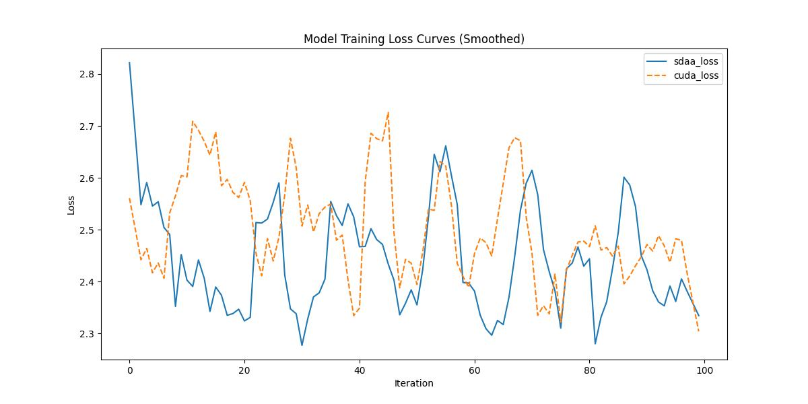

# Bottleneck Transformers for Visual Recognition(BoTNet)

## 1. 模型概述
BoTNet 是一种通用视觉表示学习方法，来自 Google Research 的论文 *[Bottleneck Transformers for Visual Recognition](https://arxiv.org/abs/2101.11605)*，由 Aravind Srinivas 等人在 2021 年发表。BoTNet 模型在 [imagenette2-320](https://github.com/fastai/imagenette) 数据集上进行预训练，。原始代码仓库位于 [https://github.com/google-research/big_transfer](https://github.com/google-research/big_transfer)。

本项目适配了 BoTNet 模型，提供在 PyTorch 框架下的训练和微调支持，适用于分类任务等场景。相关模型可参考论文 *[Bottleneck Transformers for Visual Recognition](https://arxiv.org/abs/2101.11605)*。

## 2. 快速开始
使用 BoTNet 模型执行训练的主要流程如下：
1. 基础环境安装：完成训练前的环境检查和安装。
2. 获取数据集：获取训练所需的数据集。
3. 构建环境：配置模型运行环境。
4. 启动训练：运行训练脚本。

### 2.1 基础环境安装
请参考基础环境安装章节，完成训练前的基础环境检查和安装. 

### 2.2 准备数据集
#### 2.2.1 获取数据集
BoTNet  使用 ImageNette2-320 数据集，该数据集为开源数据集，可从 [ImageNette2-320](https://github.com/fastai/imagenette) 下载。

#### 2.2.2 处理数据集
具体配置方式可参考：https://github.com/fastai/imagenette/README.md

### 2.3 构建环境

所使用的环境下已经包含 PyTorch 框架虚拟环境
1. 执行以下命令，启动虚拟环境. 
```
conda activate torch_env
```

2. 安装python依赖
```
pip install -r requirements.txt
```

### 2.4 启动训练
1. 在构建好的环境中，进入训练脚本所在目录. 
```
cd <ModelZoo_path>/PyTorch/contrib/Classification/BoTNet/run_scripts
```
2. 运行训练. 该模型支持单机单卡。
```shell
python run_BoTNet.py --img_size 224 \
        --batch_size 16 \
        --lr 0.0002 \
        ---epochs 100 \
        --output "" \
        --num_heads 4 \
        --name "BoTNet" \
```
更多训练参数参考 run_scripts/argument.py

### 2.5 训练结果
输出训练loss曲线及结果（参考使用[loss.py](./run_scripts/loss.py)）: 


MeanRelativeError: -0.014238265477240246
MeanAbsoluteError: -0.05732471466064453
Rule,mean_absolute_error -0.05732471466064453
pass mean_relative_error=np.float64(-0.014238265477240246) <= 0.05 or mean_absolute_error=np.float64(-0.05732471466064453) <= 0.0002
