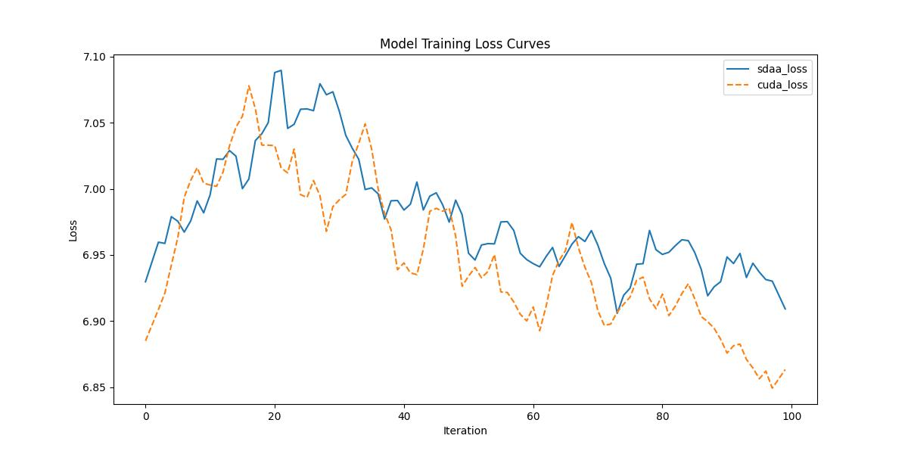

# LambdaNetworks

## 1. 模型概述
DenseNet（Densely Connected Convolutional Networks）是一种高效的卷积神经网络架构，来自论文 Densely Connected Convolutional Networks，由 Gao Huang 等人在 2017 年发表。DenseNet 通过密集连接（Dense Connectivity）在每一层之间直接连接，增强特征复用和梯度流动，相比传统 CNN 具有更低的参数量和计算复杂度，适用于图像分类、目标检测等任务。

本项目适配了 DenseNet 模型，提供在 PyTorch 框架下的训练和微调支持，适用于 CIFAR-10、CIFAR-100 和 ImageNet 数据集的分类任务。

## 2. 快速开始
使用 DenseNet 模型执行训练的主要流程如下：
1. 基础环境安装：完成训练前的环境检查和安装。
2. 获取数据集：获取训练所需的数据集。
3. 构建环境：配置模型运行环境。
4. 启动训练：运行训练脚本。

### 2.1 基础环境安装
请参考基础环境安装章节，完成训练前的基础环境检查和安装。

### 2.2 准备数据集
#### 2.2.1 获取数据集
DenseNet 使用 ImageNet 数据集，该数据集为开源数据集，可从 [ImageNet](https：//image-net.org/) 下载。


#### 2.2.2 处理数据集
具体配置方式可参考：https：//blog.csdn.net/xzxg001/article/details/142465729

### 2.3 构建环境

所使用的环境下已经包含PyTorch框架虚拟环境。
1. 执行以下命令，启动虚拟环境。
    ```
    conda activate torch_env
    ```
2. 安装python依赖。
    ```
    pip install -r requirements.txt
    ```
### 2.4 启动训练
1. 在构建好的环境中，进入训练脚本所在目录. 
```
cd <ModelZoo_path>/PyTorch/contrib/Classification/DenseNet/run_scripts
```
2. 运行训练. 该模型支持单机单卡。
```shell
python run_DenseNet.py --batch_size 128 --num_workers 4 --lr 0.05 --epoch 1 --num_steps 100 --device_num 1
```
更多训练参数参考 run_scripts/argument.py

### 2.5 训练结果
输出训练loss曲线及结果（参考使用[loss.py](./run_scripts/loss.py)）: 


MeanRelativeError: 0.0005817275664799443
MeanAbsoluteError: 0.003737578392028809
pass mean_relative_error=np.float64(0.0005817275664799443) <= 0.05 or mean_absolute_error=np.float64(0.003737578392028809) <= 0.0002