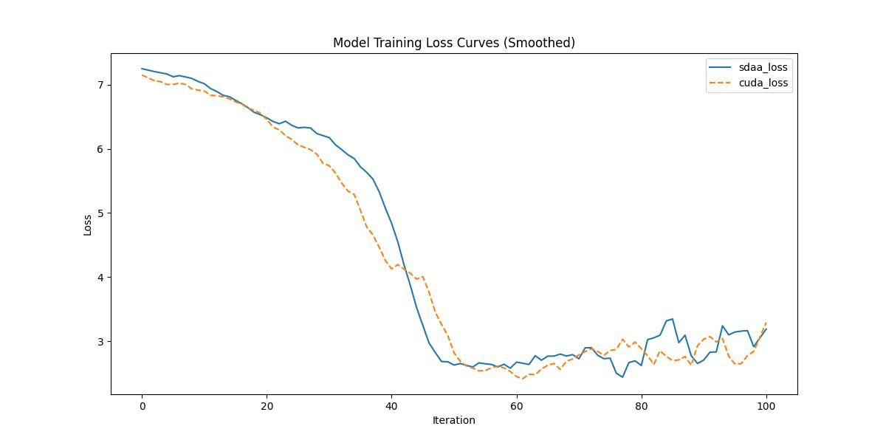

# LambdaNetworks

## 1. 模型概述
LambdaNetworks 是一种高效建模长距离交互的神经网络架构，来自论文 *[LambdaNetworks: Modeling Long-Range Interactions Without Attention](https://arxiv.org/abs/2102.08602)*，由 Irwan Bello 等人在 2021 年发表。LambdaNetworks 通过 Lambda 层捕捉全局上下文信息，相比传统注意力机制（如 Transformer）具有更低的计算复杂度，适用于图像分类、目标检测和实例分割等任务。原始代码仓库位于 [https://github.com/lucidrains/lambda-networks](https://github.com/lucidrains/lambda-networks)。

本项目适配了 LambdaNetworks 模型，提供在 PyTorch 框架下的训练和微调支持，适用于分类任务等场景。

## 2. 快速开始
使用 LambdaNetworks 模型执行训练的主要流程如下：
1. 基础环境安装：完成训练前的环境检查和安装。
2. 获取数据集：获取训练所需的数据集。
3. 构建环境：配置模型运行环境。
4. 启动训练：运行训练脚本。

### 2.1 基础环境安装
请参考基础环境安装章节，完成训练前的基础环境检查和安装。

### 2.2 准备数据集
#### 2.2.1 获取数据集
Vision Transformer 使用 Cifar 数据集，该数据集为开源数据集，可从 http://www.cs.toronto.edu/~kriz/cifar-10-python.tar.gz 下载。


#### 2.2.2 处理数据集
具体配置方式可参考：[CIFAR-10数据集（介绍、下载读取、可视化显示、另存为图片）_cifar10数据集-CSDN博客](https://blog.csdn.net/qq_40755283/article/details/125209463?ops_request_misc=%7B%22request%5Fid%22%3A%223aab7ab8bf44a13c53ce39786533e422%22%2C%22scm%22%3A%2220140713.130102334..%22%7D&request_id=3aab7ab8bf44a13c53ce39786533e422&biz_id=0&utm_medium=distribute.pc_search_result.none-task-blog-2~all~top_positive~default-1-125209463-null-null.142%5Ev102%5Epc_search_result_base6&utm_term=Cifar)。

### 2.3 构建环境

所使用的环境下已经包含PyTorch框架虚拟环境。
1. 执行以下命令，启动虚拟环境。
    ```
    conda activate torch_env
    ```
2. 安装python依赖。
    ```
    pip install -r requirements.txt
    ```
### 2.4 启动训练
1. 在构建好的环境中，进入训练脚本所在目录. 
```
cd <ModelZoo_path>/PyTorch/contrib/Classification/LambdaNetwork/run_scripts
```
2. 运行训练. 该模型支持单机单卡。
```shell
python run_LambdaNetwork.py --batch_size 128 --num_workers 4 --lr 0.05 --epoch 1 --num_steps 100 --device_num 1
```
更多训练参数参考 run_scripts/argument.py

### 2.5 训练结果
输出训练loss曲线及结果（参考使用[loss.py](./run_scripts/loss.py)）: 


MeanRelativeError: 0.03326799328261983
MeanAbsoluteError: 0.1151155434032478
Rule,mean_relative_error 0.03326799328261983
pass mean_relative_error=np.float64(0.03326799328261983) <= 0.05 or mean_absolute_error=np.float64(0.1151155434032478) <= 0.0002