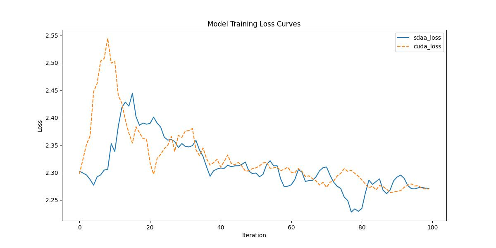

# Single Path Nas
## 1. 模型概述
Single-Path NAS 是一种高效的卷积神经网络架构，来自论文《Single-Path NAS: Designing Hardware-Efficient ConvNets in less than 4 Hours》，由 Dimitrios Stamoulis 等人在 2019 年发表。Single-Path NAS 通过提出一种新颖的可微分神经架构搜索（NAS）方法，旨在在资源受限的移动设备上实现高精度的图像分类，同时显著降低搜索时间。其核心创新在于使用单一路径的超参数化卷积网络（supernet），通过共享卷积核参数编码所有架构决策，从而大幅减少可训练参数量和搜索成本。Single-Path NAS 在 ImageNet 数据集上以 79ms 的推理延迟（Pixel 1 手机）实现了 74.96% 的 top-1 准确率，优于同等延迟约束下的其他 NAS 方法，同时搜索成本仅为 8 个 epoch（30 TPU 小时）。

本项目适配了 Single Path Nas模型，提供在 PyTorch 框架下的训练和微调支持，适用于 infar10 数据集下的分类任务等场景
## 2. 快速开始
使用 Single Path Nas 模型执行训练的主要流程如下：
1. 基础环境安装：完成训练前的环境检查和安装。
2. 获取数据集：获取训练所需的数据集。
3. 构建环境：配置模型运行环境。
4. 启动训练：运行训练脚本。

### 2.1 基础环境安装
请参考基础环境安装章节，完成训练前的基础环境检查和安装。

### 2.2 准备数据集
#### 2.2.1 获取数据集
DenseNet 使用 Cifar 数据集，该数据集为开源数据集，可从 http://www.cs.toronto.edu/~kriz/cifar-10-python.tar.gz 下载。


#### 2.2.2 处理数据集
具体配置方式可参考：[CIFAR-10数据集（介绍、下载读取、可视化显示、另存为图片）_cifar10数据集-CSDN博客](https://blog.csdn.net/qq_40755283/article/details/125209463?ops_request_misc=%7B%22request%5Fid%22%3A%223aab7ab8bf44a13c53ce39786533e422%22%2C%22scm%22%3A%2220140713.130102334..%22%7D&request_id=3aab7ab8bf44a13c53ce39786533e422&biz_id=0&utm_medium=distribute.pc_search_result.none-task-blog-2~all~top_positive~default-1-125209463-null-null.142^v102^pc_search_result_base6&utm_term=Cifar &spm=1018.2226.3001.4187)。

### 2.3 构建环境

所使用的环境下已经包含PyTorch框架虚拟环境。
1. 执行以下命令，启动虚拟环境。
    ```
    conda activate torch_env
    ```
2. 安装python依赖。
    ```
    pip install -r requirements.txt
    ```
### 2.4 启动训练
1. 在构建好的环境中，进入训练脚本所在目录. 
```
cd <ModelZoo_path>/PyTorch/contrib/Classification/SinglePathNas/run_scripts
```
2. 运行训练. 该模型支持单机单卡。
```shell
python run_spnas.py \
  --exp_name spos_c10_train_supernet \
  --layers 20 \
  --num_choices 4 \
  --batch_size 64 \
  --epochs 600 \
  --num_steps 100 \
  --lr 0.025 \
  --momentum 0.9 \
  --weight-decay 0.0003 \
  --print_freq 100 \
  --val_interval 5 \
  --save_path ./checkpoints/ \
  --seed 0 \
  --data_path data/teco-data/ \
  --classes 10 \
  --dataset cifar10 \
  --cutout \
  --cutout_length 16 \
  --auto_aug \
  --resize
```
更多训练参数参考 run_scripts/argument.py

### 2.5 训练结果
输出训练loss曲线及结果（参考使用[loss.py](./run_scripts/loss.py)）: 


MeanRelativeError: -0.005717562523789098
MeanAbsoluteError: -0.015522918701171874
pass mean_relative_error=-0.005717562523789098 <= 0.05 or mean_absolute_error=-0.015522918701171874 <= 0.0002