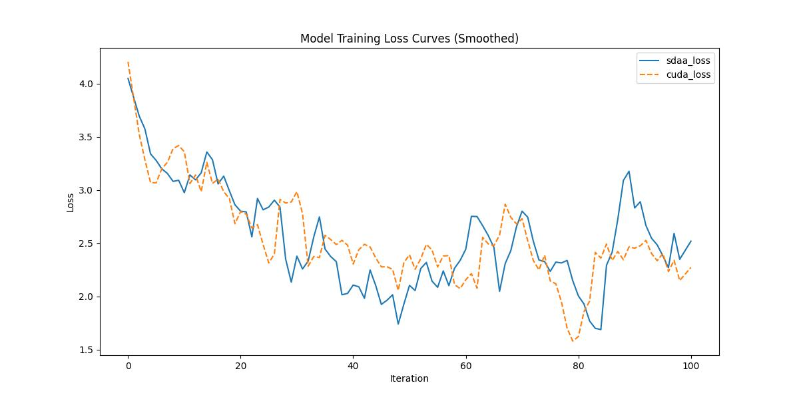

# Deeplabv3
## 1. 模型概述
 atrous 卷积是一种强大的工具，可以在语义图像分割的应用中显式调整滤波器的视场并控制深度卷积神经网络计算的特征响应的分辨率。为了处理在多尺度上分割对象的问题，我们设计了采用级联或并行的 atrous 卷积的模块，通过采用多个 atrous 速率来捕获多尺度上下文。此外，我们建议增强我们之前提出的 Atrous 空间金字塔池化模块，该模块在多个尺度上探测卷积特征，使用图像级特征编码全局上下文并进一步提高性能。我们还详细阐述了实施细节，并分享了我们在训练系统方面的经验。所提出的“DeepLabv3”系统比我们之前没有DenseCRF后处理的DeepLab版本有了显着改进，并在PASCAL VOC 2012语义图像分割基准测试中获得了与其他最先进模型相当的性能。

- 论文链接：[1706.05587\]Rethinking Atrous Convolution for Semantic Image Segmentation(https://arxiv.org/abs/1706.05587)
- 仓库链接：https://github.com/open-mmlab/mmsegmentation/tree/main/configs/deeplabv3

## 2. 快速开始
使用本模型执行训练的主要流程如下：
1. 基础环境安装：介绍训练前需要完成的基础环境检查和安装。
2. 获取数据集：介绍如何获取训练所需的数据集。
3. 构建环境：介绍如何构建模型运行所需要的环境。
4. 启动训练：介绍如何运行训练。

### 2.1 基础环境安装

请参考基础环境安装章节，完成训练前的基础环境检查和安装。

### 2.2 准备数据集
#### 2.2.1 获取数据集
 使用 Cityspaces 数据集，该数据集为开源数据集，可从 (https://opendatalab.com/) 下载。

#### 2.2.2 处理数据集
具体配置方式可参考：https://github.com/open-mmlab/mmsegmentation/blob/main/docs/en/advanced_guides/datasets.md。


### 2.3 构建环境

所使用的环境下已经包含PyTorch框架虚拟环境。
1. 执行以下命令，启动虚拟环境。
    ```
    conda activate torch_env
    ```
2. 安装python依赖。
    ```
    pip3 install  -U openmim 
    pip3 install git+https://gitee.com/xiwei777/mmengine_sdaa.git 
    pip3 install opencv_python mmcv --no-deps
    mim install -e .
    pip install -r requirements.txt

    ```

### 2.4 启动训练

1. 在构建好的环境中，进入训练脚本所在目录。
    ```
    cd <ModelZoo_path>/PyTorch/contrib/Classification/deeplabv3/run_scripts
    ```

2. 运行训练。该模型支持单机单卡。
    ```
   python run_deeplabv3.py --config ../configs/deeplabv3plus/deeplabv3plus_r50-d8_4xb2-40k_cityscapes-512x1024.py \
   --launcher pytorch --nproc-per-node 1 --amp 2>&1 | tee sdaa.log
   ```
    更多训练参数参考 run_scripts/argument.py

### 2.5 训练结果
输出训练loss曲线及结果（参考使用[loss.py](./run_scripts/loss.py)）: 



MeanRelativeErr0r:0.039869547916128616
MeanAbsoluteError:-0.0012897229430699113
Rule,mean_absolute_error 0.039869547916128616
pass mean_relative_error=0.039869547916128616 < = 0.05 or mean_absolute_error=-0.0012897229430699113<=0.0002


