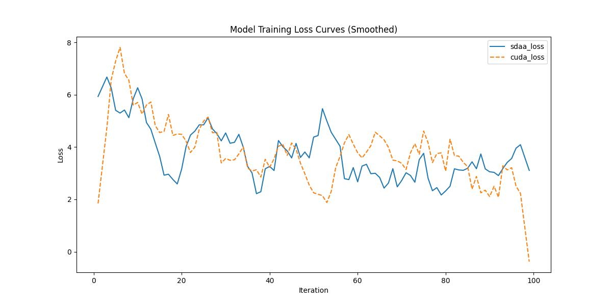

# Distilbert
## 1. 模型概述
DistilBERT 通过知识蒸馏进行预训练，以创建具有更快推理的更小模型，并且需要更少的计算来训练。通过预训练期间的三重损失目标、语言建模损失、蒸馏损失、余弦距离损失，DistilBERT 表现出与更大的 Transformer 语言模型相似的性能。


- 论文链接：[1910.01108\]DistilBERT, a distilled version of BERT: smaller, faster, cheaper and lighter(https://huggingface.co/papers/1910.01108)
- 仓库链接：https://github.com/huggingface/transformers/blob/main/docs/source/en/model_doc/distilbert.md

## 2. 快速开始
使用本模型执行训练的主要流程如下：
1. 基础环境安装：介绍训练前需要完成的基础环境检查和安装。
2. 获取数据集：介绍如何获取训练所需的数据集。
3. 构建环境：介绍如何构建模型运行所需要的环境。
4. 启动训练：介绍如何运行训练。

### 2.1 基础环境安装

请参考基础环境安装章节，完成训练前的基础环境检查和安装。

### 2.2 准备数据集
#### 2.2.1 获取数据集
该数据集为开源数据集，可从 [zhwiki](https://dumps.wikimedia.org/zhwiki/latest/zhwiki-latest-pages-articles.xml.bz2) 下载。

#### 2.2.2 处理数据集
具体配置方式可参考：https://blog.csdn.net/weixin_39709674/article/details/111847635。


### 2.3 构建环境

所使用的环境下已经包含PyTorch框架虚拟环境。
1. 执行以下命令，启动虚拟环境。
    ```
    conda activate torch_env
    ```
2. 安装python依赖。
    ```
    git clone https://gitee.com/xiwei777/tcap_dllogger.git
    cd tcap_dllogger
    python setup.py install
    cd .. 
    pip install -r requirements.txt
    pip3 install numpy==1.24.3
    pip install huggingface_hub
    pip install parameterized
    ```

### 2.4 启动训练

1. 在构建好的环境中，进入训练脚本所在目录。
    ```
    cd <ModelZoo_path>/PyTorch/contrib/Classification/distilbert/run_scripts
    ```

2. 运行训练。该模型支持单机单卡。
    ```
    mkdir -p distilbert_out && python run_distilbert.py \
    --train_file ../configs/train_sample.txt \
    --do_train --do_eval \
    --output_dir distilbert_out \
    --overwrite_output_dir \
    --per_device_train_batch_size 2 \
    --max_seq_length 32 \
    --line_by_line   2>&1 | tee sdaa.log
   ```
    更多训练参数参考 run_scripts/argument.py

### 2.5 训练结果
输出训练loss曲线及结果（参考使用[loss.py](./run_scripts/loss.py)）: 



MeanRelativeError:0.890243939077245
MeanAbsoluteError:-0.0401000000000002
Rule,mean_absolute_error 0.890243939077245
pass mean_relative_error=0.890243939077245 <=0.05 or mean_absolute_error=-0.0401000000000002<=0.0002

