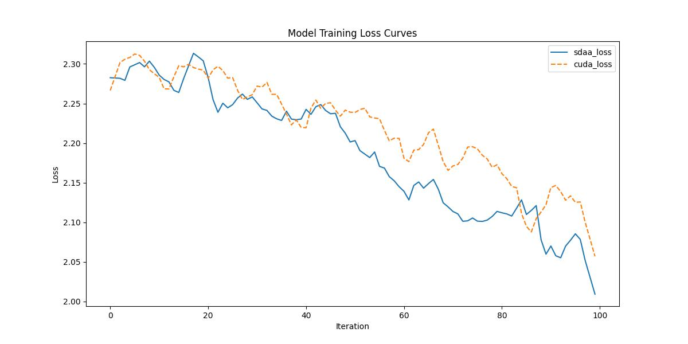

# gMLP
## 1. 模型概述
gMLP 是一种高效的神经网络架构，来自论文《Pay Attention to MLPs》，由 Hanxiao Liu 等人在 2021 年发表。gMLP（Gated Multilayer Perceptron）通过提出一种基于纯多层感知机（MLP）的架构，旨在以较低的计算复杂度和参数量实现与 Transformer 相媲美的性能，适用于图像分类和自然语言处理等任务。其核心创新在于引入了空间门控单元（Spatial Gating Unit, SGU），通过空间交互机制捕捉序列或图像中的长距离依赖，而无需依赖自注意力机制。gMLP 在 ImageNet 数据集上以 80.0% 的 top-1 准确率（gMLP-S 模型）实现了高效推理，参数量和计算量显著低于同等性能的 Transformer 模型。

本项目适配了 gMLP 模型，提供在 PyTorch 框架下的训练，适用于 CIFAR-10 数据集下的分类任务等场景。
## 2. 快速开始
使用 gMLP 模型执行训练的主要流程如下：
1. 基础环境安装：完成训练前的环境检查和安装。
2. 获取数据集：获取训练所需的数据集。
3. 构建环境：配置模型运行环境。
4. 启动训练：运行训练脚本。

### 2.1 基础环境安装
请参考基础环境安装章节，完成训练前的基础环境检查和安装。

### 2.2 准备数据集
#### 2.2.1 获取数据集
gMLP 使用 Cifar 数据集，该数据集为开源数据集，可从 http://www.cs.toronto.edu/~kriz/cifar-10-python.tar.gz 下载。


#### 2.2.2 处理数据集
具体配置方式可参考：[CIFAR-10数据集（介绍、下载读取、可视化显示、另存为图片）_cifar10数据集-CSDN博客](https://blog.csdn.net/qq_40755283/article/details/125209463?ops_request_misc=%7B%22request%5Fid%22%3A%223aab7ab8bf44a13c53ce39786533e422%22%2C%22scm%22%3A%2220140713.130102334..%22%7D&request_id=3aab7ab8bf44a13c53ce39786533e422&biz_id=0&utm_medium=distribute.pc_search_result.none-task-blog-2~all~top_positive~default-1-125209463-null-null.142^v102^pc_search_result_base6&utm_term=Cifar &spm=1018.2226.3001.4187)。

### 2.3 构建环境

所使用的环境下已经包含PyTorch框架虚拟环境。
1. 执行以下命令，启动虚拟环境。
    ```
    conda activate torch_env
    ```
2. 安装python依赖。
    ```
    pip install -r requirements.txt
    ```
### 2.4 启动训练
1. 在构建好的环境中，进入训练脚本所在目录. 
```
cd <ModelZoo_path>/PyTorch/contrib/Classification/gMLP/run_scripts
```
2. 运行训练. 该模型支持单机单卡。
```shell
python3 run_gmlp.py --data_path /data/teco-data/imagenet --batch_size 64 --epochs 1 --lr 3e-4 --save_path ./checkpoints --num_steps 100
```
更多训练参数参考 run_scripts/argument.py

### 2.5 训练结果
输出训练loss曲线及结果（参考使用[loss.py](./run_scripts/loss.py)）: 


MeanRelativeError: -0.013812976206719252
MeanAbsoluteError: -0.030710947513580323
pass mean_relative_error=-0.013812976206719252 <= 0.05 or mean_absolute_error=-0.030710947513580323 <= 0.0002