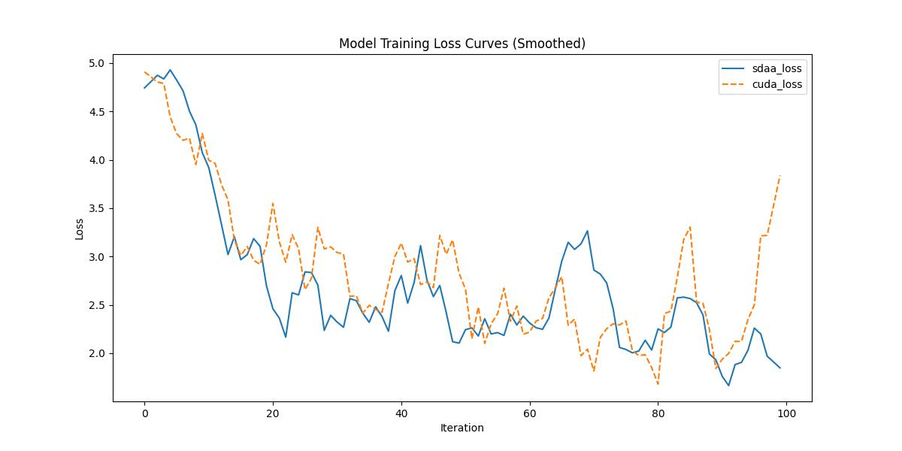

#ICNET
## 1. 模型概述
本文聚焦于实时语义分割这一极具挑战性的任务。该任务在实际应用中广泛存在，但其核心挑战是如何大幅降低像素级标签推理的计算量。为了应对这一挑战，提出了一种图像级联网络 (ICNet)，该网络在适当的标签指导下融合了多分辨率分支。对框架进行了深入分析，并引入了级联特征融合单元，以快速实现高质量的分割。我们的系统在单张 GPU 上即可进行实时推理，并在 Cityscapes、CamVid 和 COCO-Stuff 等高难度数据集上获得了良好的质量评估结果。

- 论文链接：[1704.08545\]ICNet for Real-time Semantic Segmentation on High-resolution Images(https://arxiv.org/abs/1704.08545)
- 仓库链接：https://github.com/open-mmlab/mmpretrain/tree/main/configs/icnet

## 2. 快速开始
使用本模型执行训练的主要流程如下：
1. 基础环境安装：介绍训练前需要完成的基础环境检查和安装。
2. 获取数据集：介绍如何获取训练所需的数据集。
3. 构建环境：介绍如何构建模型运行所需要的环境。
4. 启动训练：介绍如何运行训练。

### 2.1 基础环境安装

请参考基础环境安装章节，完成训练前的基础环境检查和安装。

### 2.2 准备数据集
#### 2.2.1 获取数据集
 使用 Cityspaces 数据集，该数据集为开源数据集，可从 (https://opendatalab.com/) 下载。

#### 2.2.2 处理数据集
具体配置方式可参考：https://github.com/open-mmlab/mmsegmentation/blob/main/docs/en/advanced_guides/datasets.md。


### 2.3 构建环境

所使用的环境下已经包含PyTorch框架虚拟环境。
1. 执行以下命令，启动虚拟环境。
    ```
    conda activate torch_env
    ```
2. 安装python依赖。
    ```
    pip3 install  -U openmim 
    pip3 install git+https://gitee.com/xiwei777/mmengine_sdaa.git 
    pip3 install opencv_python mmcv --no-deps
    mim install -e .
    pip install -r requirements.txt

    ```

### 2.4 启动训练

1. 在构建好的环境中，进入训练脚本所在目录。
    ```
    cd <ModelZoo_path>/PyTorch/contrib/Classification/icnet/run_scripts
    ```

2. 运行训练。该模型支持单机单卡。
    ```
    python run_icnet.py --config ../configs/icnet/icnet_r50-d8_4xb2-80k_cityscapes-832x832.py \
       --launcher pytorch --nproc-per-node 1 --amp 2>&1 | tee sdaa.log
   ```
    更多训练参数参考 run_scripts/argument.py

### 2.5 训练结果
输出训练loss曲线及结果（参考使用[loss.py](./run_scripts/loss.py)）: 



MeanRelativeErr0r:0.038494982164002774
MeanAbsoluteError:-0.150012130730468
Rule,mean_absolute_error -0.150012130730468
pass mean_relative_error=0.038494982164002774 < = 0.05 or mean_absolute_error=-0.150012130730468<=0.0002


