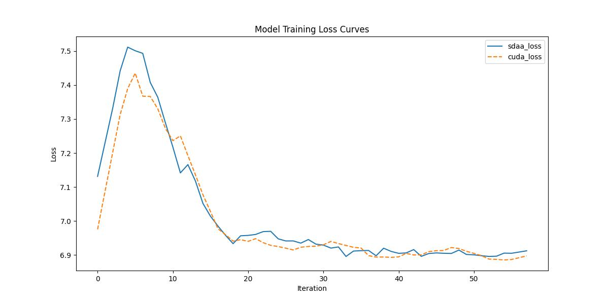

# MixNet

## 1. 模型概述
MixNet 是一种高效的卷积神经网络架构，来自论文《MixConv: Mixed Depthwise Convolutional Kernels》，由 Mingxing Tan 和 Quoc V. Le 在 2019 年发表。MixNet 提出了一种新颖的混合深度卷积（MixConv）策略，通过在单一卷积层中使用多种不同大小的卷积核（如 3x3、5x5、7x7），以捕获多尺度特征，从而提升图像分类性能。其设计目标是针对资源受限的设备（如移动设备），在保持高精度的同时优化计算效率。MixNet 通过自动搜索最优的卷积核组合，进一步结合了神经架构搜索（NAS）技术，生成了 MixNet-S、MixNet-M 和 MixNet-L 等一系列模型。这些模型在 ImageNet 数据集上实现了高 top-1 准确率（如 MixNet-L 达到 78.9%），同时保持较低的计算复杂度（FLOPs），适用于移动端部署。

## 2. 快速开始
使用 MixNet 模型执行训练的主要流程如下：
1. 基础环境安装：完成训练前的环境检查和安装。
2. 获取数据集：获取训练所需的数据集。
3. 构建环境：配置模型运行环境。
4. 启动训练：运行训练脚本。

### 2.1 基础环境安装
请参考基础环境安装章节，完成训练前的基础环境检查和安装。

### 2.2 准备数据集
#### 2.2.1 获取数据集
MixNet 使用 ImageNet 数据集，该数据集为开源数据集，可从 [ImageNet](https：//image-net.org/) 下载。


#### 2.2.2 处理数据集
具体配置方式可参考：https：//blog.csdn.net/xzxg001/article/details/142465729

### 2.3 构建环境

所使用的环境下已经包含PyTorch框架虚拟环境。
1. 执行以下命令，启动虚拟环境。
    ```
    conda activate torch_env
    ```
2. 安装python依赖。
    ```
    pip install -r requirements.txt
    ```
### 2.4 启动训练
1. 在构建好的环境中，进入训练脚本所在目录. 
```
cd <ModelZoo_path>/PyTorch/contrib/Classification/mixnet/run_scripts
```
2. 运行训练. 该模型支持单机单卡。
```shell
python3 run_mixnet.py --data_path /data/teco-data/imagenet --batch_size 64 --epochs 1 --lr 0.1 --save_path ./checkpoints --num_steps 100
```
更多训练参数参考 run_scripts/argument.py

### 2.5 训练结果
输出训练loss曲线及结果（参考使用[loss.py](./run_scripts/loss.py)）: 


MeanRelativeError: 0.002445163588966889
MeanAbsoluteError: 0.017218417134778254
pass mean_relative_error=0.002445163588966889 <= 0.05 or mean_absolute_error=0.017218417134778254 <= 0.0002