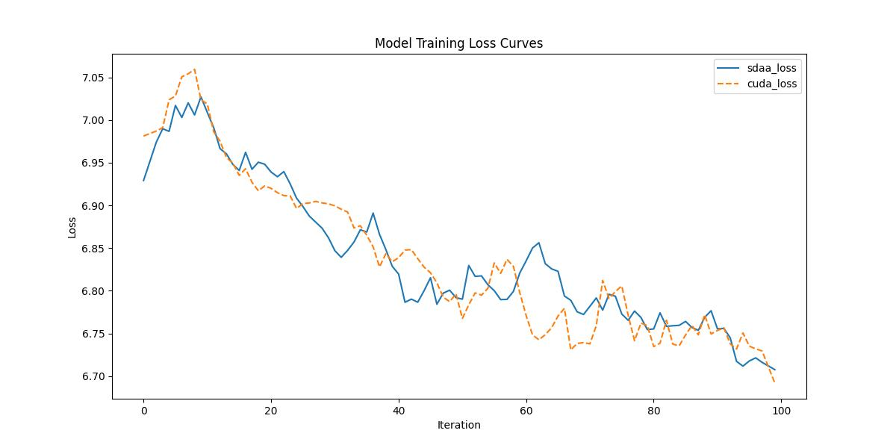

# MLP-Mixer

## 1. 模型概述
MLP-Mixer 是一种新颖的神经网络架构，来自论文《MLP-Mixer: An All-MLP Architecture for Vision》，由 Ilya Tolstikhin 等人在 2021 年发表。MLP-Mixer 提出了一种完全基于多层感知机（MLP）的视觉处理架构，摒弃了传统的卷积和自注意力机制，通过两个关键的 MLP 操作实现特征混合，以更简单的结构实现高效的图像分类性能。本项目适配了 MLP-Mixer 模型，提供在 PyTorch 框架下的训练支持，适用于 ImageNet数据集下的分类任务等场景。

## 2. 快速开始
使用 MLP-Mixer 模型执行训练的主要流程如下：
1. 基础环境安装：完成训练前的环境检查和安装。
2. 获取数据集：获取训练所需的数据集。
3. 构建环境：配置模型运行环境。
4. 启动训练：运行训练脚本。

### 2.1 基础环境安装
请参考基础环境安装章节，完成训练前的基础环境检查和安装。

### 2.2 准备数据集
#### 2.2.1 获取数据集
MLP-Mixer 使用 ImageNet 数据集，该数据集为开源数据集，可从 [ImageNet](https：//image-net.org/) 下载。


#### 2.2.2 处理数据集
具体配置方式可参考：https：//blog.csdn.net/xzxg001/article/details/142465729

### 2.3 构建环境

所使用的环境下已经包含PyTorch框架虚拟环境。
1. 执行以下命令，启动虚拟环境。
    ```
    conda activate torch_env
    ```
2. 安装python依赖。
    ```
    pip install -r requirements.txt
    ```
### 2.4 启动训练
1. 在构建好的环境中，进入训练脚本所在目录. 
```
cd <ModelZoo_path>/PyTorch/contrib/Classification/mlpmixer/run_scripts
```
2. 运行训练. 该模型支持单机单卡。
```shell
python3 run_mlpmixer.py --data_path /data/teco-data/imagenet --batch_size 64 --epochs 1 --lr 0.1 --save_path ./checkpoints --num_steps 100
```
更多训练参数参考 run_scripts/argument.py

### 2.5 训练结果
输出训练loss曲线及结果（参考使用[loss.py](./run_scripts/loss.py)）: 


MeanRelativeError: 0.00036917385332645576
MeanAbsoluteError: 0.001968851089477539
pass mean_relative_error=0.00036917385332645576 <= 0.05 or mean_absolute_error=0.001968851089477539 <= 0.0002