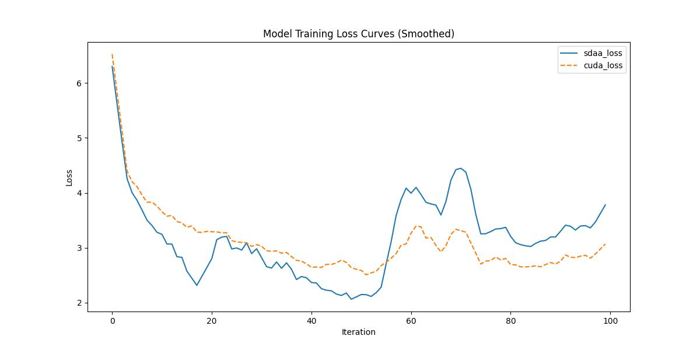

# Transformerxl
## 1. 模型概述
Transformer 具有学习长期依赖关系的潜力，但在语言建模设置中受到固定长度上下文的限制。提出了一种新颖的神经架构 Transformer-XL，它可以在不破坏时间连贯性的情况下实现超出固定长度的学习依赖性。它由段级递归机制和新颖的位置编码方案组成。我们的方法不仅能够捕获更长期的依赖关系，而且还解决了上下文碎片问题。因此，Transformer-XL 学习的依赖性比 RNN 长 80%，比普通 Transformer 长 450%，在短序列和长序列上都取得了更好的性能，并且在评估过程中比普通 Transformer 快 1,800+ 倍。值得注意的是，我们将 bpc/perplexity 的最新结果提高到 enwiki8 的 0.99、text8 的 1.08、WikiText-103 的 18.3、One Billion Word 的 21.8 和 Penn Treebank 的 54.5（无需微调）。当仅在 WikiText-103 上进行训练时，Transformer-XL 设法生成具有数千个标记的合理连贯、新颖的文本文章。我们的代码、预训练模型和超参数在 Tensorflow 和 PyTorch 中均可用。


- 论文链接：[1901.02860\]Transformer-XL: Attentive Language Models Beyond a Fixed-Length Context(https://arxiv.org/abs/1901.02860)
- 仓库链接：https://github.com/kimiyoung/transformer-xl

## 2. 快速开始
使用本模型执行训练的主要流程如下：
1. 基础环境安装：介绍训练前需要完成的基础环境检查和安装。
2. 获取数据集：介绍如何获取训练所需的数据集。
3. 构建环境：介绍如何构建模型运行所需要的环境。
4. 启动训练：介绍如何运行训练。

### 2.1 基础环境安装

请参考基础环境安装章节，完成训练前的基础环境检查和安装。

### 2.2 准备数据集
#### 2.2.1 获取数据集
该数据集为开源数据集，可从 [enwik8](https://huggingface.co/datasets/LTCB/enwik8/viewer 查看，运行bash getdata.sh可下载。

#### 2.2.2 处理数据集
具体配置方式可参考：https://www.selectdataset.com/dataset/f3c8456f6575586dd8bb76228f9120a0。


### 2.3 构建环境

所使用的环境下已经包含PyTorch框架虚拟环境。
1. 执行以下命令，启动虚拟环境。
    ```
    conda activate torch_env
    ```
2. 安装python依赖。
    ```
    git clone https://gitee.com/xiwei777/tcap_dllogger.git
    cd tcap_dllogger
    python setup.py install
    cd ..
    cd .. 
    pip install -r requirements.txt
    cd run_scripts   

    ```

### 2.4 启动训练

1. 在构建好的环境中，进入训练脚本所在目录。
    ```
    cd <ModelZoo_path>/PyTorch/contrib/Classification/transformerxl/run_scripts
    ```

2. 运行训练。该模型支持单机单卡。
    ```
    python run_transformerxl.py --nproc-per-node 1 2>&1 | tee sdaa.log

   ```
    更多训练参数参考 run_scripts/argument.py

### 2.5 训练结果
输出训练loss曲线及结果（参考使用[loss.py](./run_scripts/loss.py)）: 



MeanRelativeError:0.026967808668062615
MeanAbsoluteError:0.07190277934074402
Rule,mean_absolute_error 0.026967808668062615
pass mean_relative_error=0.026967808668062615 <=0.05 or mean_absolute_error=0.07190277934074402<=0.0002

