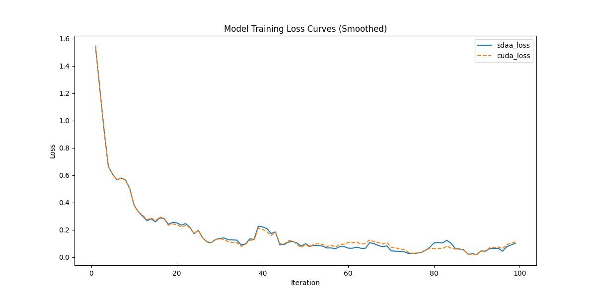

# XLnet
## 1. 模型概述
XLNet模型由Zhilin Yang， Zihang Dai， Yiming Yang， Jaime Carbonell， Ruslan Salakhutdinov， Quoc 诉 Le.XLnet 是 Transformer-XL 模型的扩展，使用自回归方法进行预训练以学习 通过最大化输入序列分解的所有排列的预期似然来实现双向上下文 次序。
凭借对双向上下文建模的能力，像 BERT 这样基于自动编码的去噪预训练可以实现 比基于自回归语言建模的预训练方法更好的性能。但是，依赖于 用掩码破坏输入，BERT 会忽略掩码位置之间的依赖性，并遭受 pretrain-finetune 差异。鉴于这些优点和缺点，我们提出了 XLNet，一种广义的自回归 预训练方法，（1） 通过最大化所有预期可能性来实现学习双向上下文 分解顺序的排列，以及 （2） 克服了 BERT 的局限性，这要归功于其自回归 配方。此外，XLNet 将最先进的自回归模型 Transformer-XL 的想法集成到 预训练。根据经验，在可比较的实验设置下，XLNet 在 20 项任务上优于 BERT，通常远远超过 BERT 边距，包括问答、自然语言推理、情感分析和文档排名。


- 论文链接：[1906.08237\]XLNet: Generalized Autoregressive Pretraining for Language Understanding(https://huggingface.co/papers/1906.08237)
- 仓库链接：https://github.com/huggingface/transformers/blob/main/docs/source/en/model_doc/xlnet.md

## 2. 快速开始
使用本模型执行训练的主要流程如下：
1. 基础环境安装：介绍训练前需要完成的基础环境检查和安装。
2. 获取数据集：介绍如何获取训练所需的数据集。
3. 构建环境：介绍如何构建模型运行所需要的环境。
4. 启动训练：介绍如何运行训练。

### 2.1 基础环境安装

请参考基础环境安装章节，完成训练前的基础环境检查和安装。

### 2.2 准备数据集
#### 2.2.1 获取数据集
该数据集为开源数据集，可从 [zhwiki](https://dumps.wikimedia.org/zhwiki/latest/zhwiki-latest-pages-articles.xml.bz2) 下载。

#### 2.2.2 处理数据集
具体配置方式可参考：https://blog.csdn.net/weixin_39709674/article/details/111847635。


### 2.3 构建环境

所使用的环境下已经包含PyTorch框架虚拟环境。
1. 执行以下命令，启动虚拟环境。
    ```
    conda activate torch_env
    ```
2. 安装python依赖。
    ```
    git clone https://gitee.com/xiwei777/tcap_dllogger.git
    cd tcap_dllogger
    python setup.py install
    cd .. 
    pip install -r requirements.txt
    pip3 install numpy==1.24.3
    pip install huggingface_hub
    pip install parameterized
    pip install protobuf==4.25.8
    pip install sentencepiece==0.2.0
    ```

### 2.4 启动训练

1. 在构建好的环境中，进入训练脚本所在目录。
    ```
    cd <ModelZoo_path>/PyTorch/contrib/Classification/t5/run_scripts
    ```

2. 运行训练。该模型支持单机单卡。
    ```
    mkdir -p xlnet_out && python run_xlnet.py \
    --train_file ../configs/train_sample.txt \
    --do_train --do_eval \
    --output_dir xlnet_out \
    --overwrite_output_dir \
    --per_device_train_batch_size 2 \
    --max_seq_length 32 \
    --line_by_line   2>&1 | tee sdaa.log
   ```
    更多训练参数参考 run_scripts/argument.py

### 2.5 训练结果
输出训练loss曲线及结果（参考使用[loss.py](./run_scripts/loss.py)）: 



MeanRelativeError:0.02515059350528735
MeanAbsoluteError:-0.0017171717171717
Rule,mean_absolute_error 0.02515059350528735
pass mean_relative_error=0.02515059350528735 <=0.05 or mean_absolute_error=-0.0017171717171717<=0.0002

